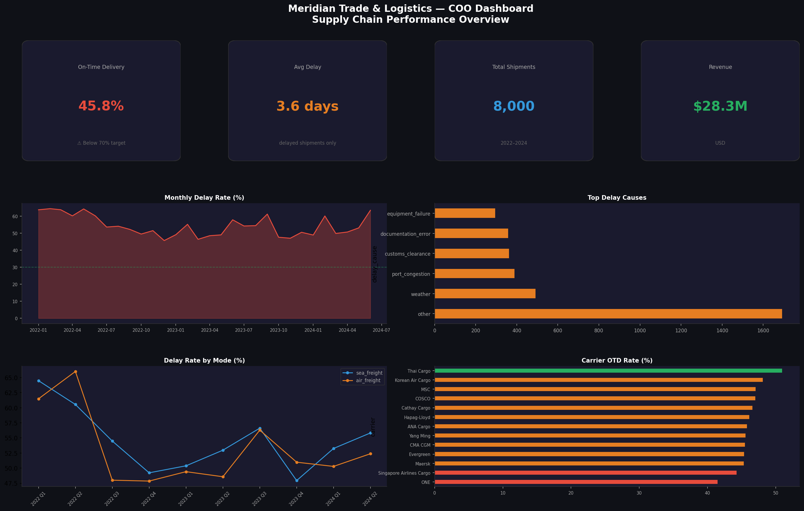
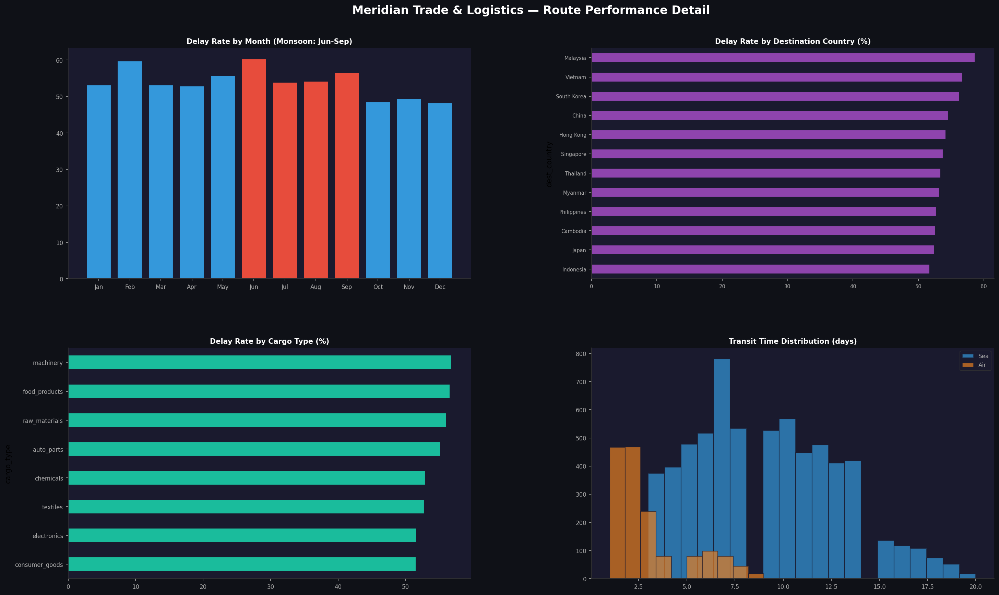

# Meridian Trade & Logistics — Supply Chain Delay Analysis

## Project Overview

Analysis of shipment delays across Southeast Asian and East Asian maritime and air freight routes for **Meridian Trade & Logistics Pte. Ltd.** (Singapore).

The company's on-time delivery rate had fallen below acceptable levels. This project identifies root causes, quantifies seasonal and carrier-level patterns, and provides a KPI dashboard for the COO.

**Data scope:** 8,000 shipments | 15 ports | 13 carriers | Jan 2022 – Jun 2024

## Key Findings

- **On-time delivery rate: 45.8%** — well below the 70-80% industry benchmark
- **Top delay causes:** port congestion, customs clearance, weather
- **Monsoon season (Jun-Sep)** adds 5-8pp to delay rates for SEA routes
- **Sea freight delays higher** (55.8%) than air freight (47.6%)
- **Carrier OTD variance:** ~10pp gap between best and worst performers
- **2022 H1 worst period** due to post-COVID port congestion

## Repository Structure
```
├── data/
│   ├── raw/                      # Shipment and port reference data
│   ├── processed/                # KPI summary, route scorecard
│   └── sql/                      # Data quality queries
├── notebooks/
│   ├── 01_eda.ipynb              # Exploratory data analysis
│   └── 02_kpi_analysis.ipynb     # KPI analysis and route scoring
├── reports/
│   ├── executive_summary.md      # Findings and recommendations
│   └── figures/                  # Analysis visualizations
└── dashboard/
    └── screenshots/              # Power BI dashboard previews
```

## Dashboard Preview





## Recommendations

1. **Carrier SLA renegotiation** — set minimum OTD targets with penalty clauses
2. **Pre-clearance protocol** — submit customs docs 48h before departure
3. **Monsoon buffer** — add 2-3 buffer days for SEA routes during Jun-Sep
4. **Port diversification** — reduce dependency on congested ports (Jakarta, Manila)
5. **Mode switching** — offer air freight for time-sensitive cargo during peak congestion

## Stack

- **Python** (pandas, NumPy, seaborn, matplotlib)
- **SQL**
- **Power BI**

## Author

Nurbol Sultanov — Data Analyst